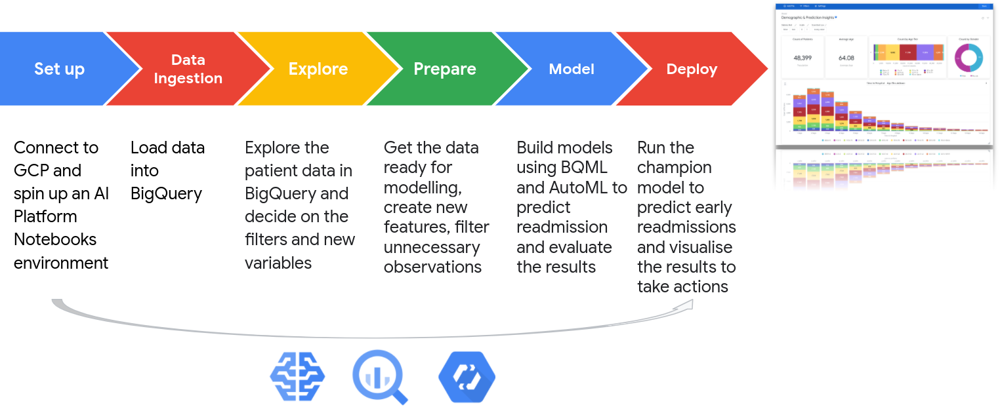
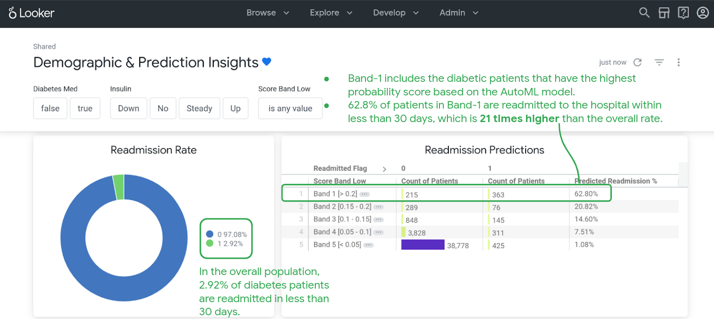

### Healthcare application of Machine Learning on Google Cloud Platform  
### Predicting patient hospital readmission with BQML and AutoML  
[colab link](https://colab.research.google.com/drive/1Qv8fex_3F8J6nEIETk-K7wHjUN6YTG92?usp=sharing)  
#### **What is the business problem:**  
Predict the likelihood of hospital readmission for diabetes patients.  
Avoid early discharge of patients to home in order to decrease the rate of readmission.  
#### **Download data from:**  
The public data used in the exercise will be downloaded from the [Kaggle website](https://www.kaggle.com/friedrichschneider/diabetic-dataset-for-readmission). This will require you to sign in to Kaggle. Find the descriptions of the variables [here](https://www.kaggle.com/iabhishekofficial/prediction-on-hospital-readmission).  
#### **Machine learning steps:**  
  
#### **The technology used:**  
- [AI Platform on GCP](https://cloud.google.com/ai-platform)
- [BigQuery ML](https://cloud.google.com/bigquery-ml/docs)
- [Looker](https://looker.com/) 

Follow [this notebook](Predict-hospital-readmission-with-BQML-and-AutoML.ipynb) to build your healthcare ML application on GCP using BigQuery and Python libraries for **data preparation and feature engineering** to enrich your data, BigQuery ML and AutoML for **model building and evaluating** the results and Looker for **visualisation**.  
The details for the visualisations in Looker are not covered in this repository. Please check the Looker website and the documentation [here](https://docs.looker.com/).  
#### **Model results:**  
  
##### **the end.** 